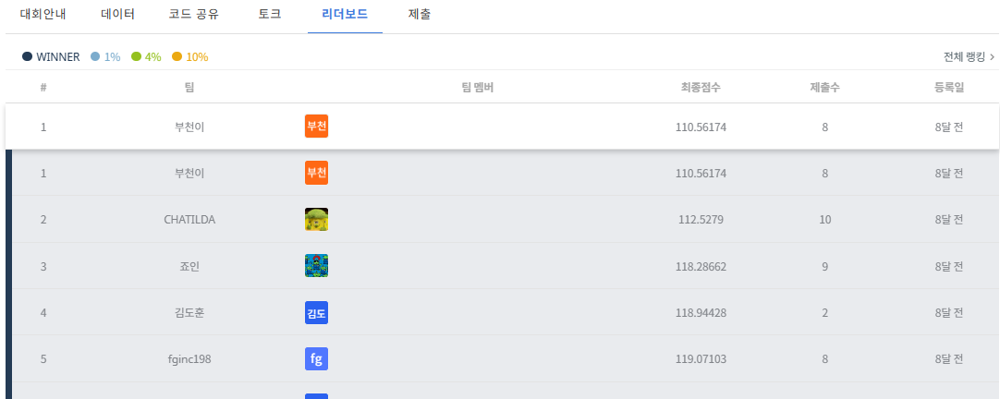
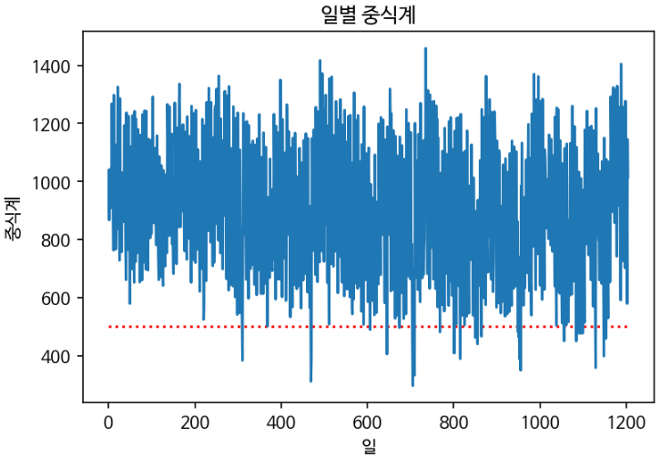
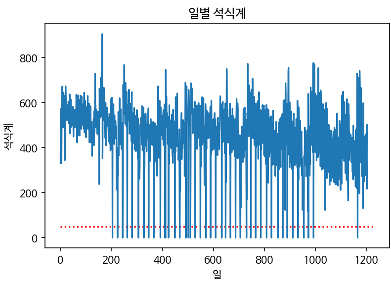
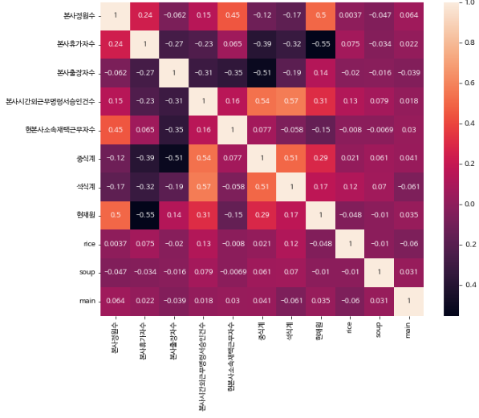

# 수원대학교 DACON 구내식당 식수 예측

2022 수원대학교 DACON 구내식당 식사 인원 예측 대회 프로젝트입니다.

날짜별 근무 인원, 휴가자 수, 출장자 수, 재택근무자 수, 초과근무 승인 건수 등을 이용해 중식계와 석식계를 예측했습니다.

## 성과

- Private 리더보드 1위
- XGBoost 회귀 모델 사용
- 중식계와 석식계를 각각 별도 모델로 예측

## 모델링

최종 모델은 메뉴 텍스트보다 근무 인원과 날짜 변수에 집중했습니다. 메뉴도 식수 인원에 영향을 줄 수 있지만, 기본적으로 그날 회사에 실제로 남아 있는 인원과 요일 패턴의 영향이 크다고 판단했습니다.

사용한 주요 변수는 아래와 같습니다.

- `요일`: 월-금 요일 정보
- `월`, `일`: 날짜에서 추출한 월/일
- `현재원`: `본사정원수 - 본사휴가자수 - 본사출장자수 - 현본사소속재택근무자수`
- `본사휴가자수`, `본사출장자수`, `본사시간외근무명령서승인건수`, `현본사소속재택근무자수`

석식은 운영하지 않은 날이 포함되어 있어 `석식계`가 0인 행은 학습에서 제외했습니다.

추가로 메뉴 중 국과 메인 반찬이 식수 인원에 영향을 줄 수 있다고 보고, 일부 호불호가 갈리는 메뉴를 따로 확인했습니다. 다만 최종 제출 모델은 근무 인원과 날짜 변수 중심으로 구성했습니다.

## 코드 구성

주요 로직은 아래 파일에 나누어 두었습니다.

- `src/siksu/features.py`: 요일 인코딩, 날짜 피처, 현재원 계산
- `src/siksu/modeling.py`: XGBoost 회귀 모델 학습
- `src/siksu/pipeline.py`: 중식/석식 예측과 제출 파일 생성 흐름
- `notebooks/01_modeling.ipynb`: 전체 모델링 흐름 요약
- `notebooks/original`: 기존 노트북 원본 보관
- `docs/original_readme.md`: 기존 README 원문 보관

## 시각화

일별 중식계와 석식계를 먼저 확인했고, 석식계는 0에 가까운 값이 반복적으로 나타나는 점을 별도로 처리했습니다.

|||
| :-- | :-- |
|||

근무 인원 관련 변수와 식수 인원의 상관관계도 함께 확인했습니다.

